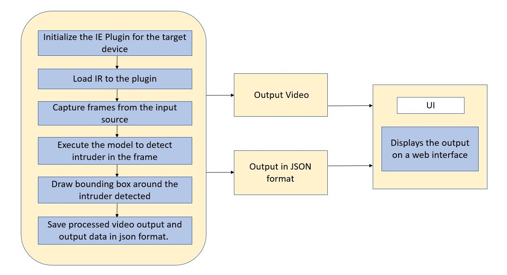
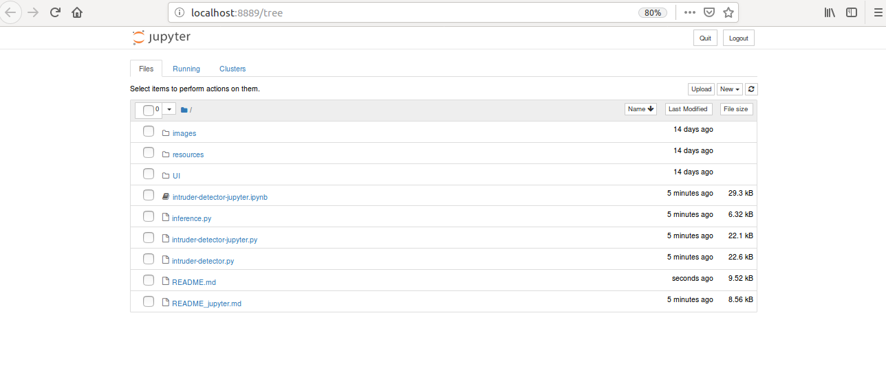
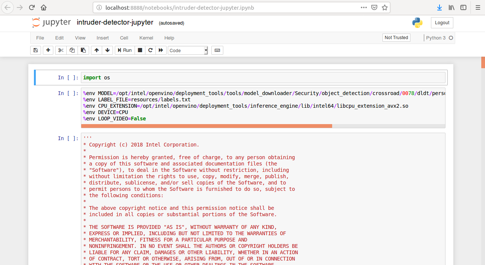

# Intruder Detector

| Details               |                   |
| --------------------- | ----------------- |
| Target OS:            | Ubuntu* 16.04 LTS |
| Programming Language: | Python* 3         |
| Time to Complete:     | 45 min            |


**Figure 1:** An application capable of detecting any number of objects from a video input.

## What It Does

This application is one of a series of IoT reference implementations illustrating how to develop a working solution for a problem. The reference implementation demonstrates how to create a smart video IoT solution using Intel® hardware and software tools. This solution detects any number of objects in a designated area, providing the number of objects in the frame and total count.

## Requirements

### Hardware

- 6th to 8th generation Intel® Core™ processors with Iris® Pro graphics or Intel® HD Graphics

### Software

- [Ubuntu\* 16.04 LTS](http://releases.ubuntu.com/16.04/)<br>
  NOTE: Use kernel versions 4.14+ with this software.<br> 
   Determine the kernel version with the below uname command. 

  ```
   uname -a
  ```

- Intel® Distribution of OpenVINO™ toolkit 2019 R1 release

## How It Works

The counter uses the Inference Engine included in the Intel® Distribution of OpenVINO™ toolkit. A trained neural network detects objects within a designated area by displaying a green bounding box over them and registers them in a logging system.



**Figure 2:**  Architectural Diagram.

## Setup

### Install Intel® Distribution of OpenVINO™ toolkit

Refer to [Install Intel® Distribution of OpenVINO™ toolkit for Linux*](https://software.intel.com/en-us/articles/OpenVINO-Install-Linux) to learn how to install and configure the toolkit.

Install the OpenCL™ Runtime Package to run inference on the GPU, as described in the instructions below. It is not mandatory for CPU inference.

### Install FFmpeg*

FFmpeg* is installed separately from the Ubuntu repositories:

```
sudo apt update
sudo apt install ffmpeg
```

### Install Python Dependencies

```
sudo apt update
sudo apt install python3-pip python3-numpy
pip3 install jupyter
```

## Configure the Application

### Which Model to Use

By default, this application uses the **person-vehicle-bike-detection-crossroad-0078** Intel® model, that can be accessed using the **model downloader**. The **model downloader** downloads the __.xml__ and __.bin__ files that will be used by the application.

#### Download the __.xml__ and __.bin__ files

Go to the **model downloader** directory present inside Intel® Distribution of OpenVINO™ toolkit.

  ```
  cd /opt/intel/openvino/deployment_tools/tools/model_downloader
  ```

- Specify which model to download with `--name`.<br><br>

- To optimize the model for FP32, run the following commands:

  ```
  sudo ./downloader.py --name person-vehicle-bike-detection-crossroad-0078
  ```
- To optimize the model for FP16, run the following command:
   ```
   sudo ./downloader.py --name person-vehicle-bike-detection-crossroad-0078-fp16
   ```
The files will be downloaded inside the Security/object_detection/crossroad/0078/dldt directory.

### The Labels File

In order to work, this application requires a _labels_ file associated with the model being used for detection.  
All detection models work with integer labels, not string labels (e.g., For the **person-vehicle-bike-detection-crossroad-0078** model, the number 1 represents the class "person"). Each model must have a _labels_ file, which associates an integer, the label the algorithm detects, with a string denoting the human-readable label.

The _labels_ file is a text file containing all the classes/labels that the model can recognize, in the order that it was trained to recognize them (one class per line).

For the **person-vehicle-bike-detection-crossroad-0078** model, find the class file _labels.txt_ in the resources folder.

### The Config File

The _resources/conf.txt_ contains the path to the videos that will be used by the application, followed by the labels to be detected on those videos. All labels (intruders) defined will be detected on all videos.   

Each line of the _conf.txt_ file is of the form `video: <path/to/video>` or `intruder: <label>`   
The labels used in the _conf.txt_ file must coincide with the labels from the _labels_ file.

Example of the _conf.txt_ file:

```
video: videos/video1.mp4
video: videos/video2.avi
intruder: person
intruder: dog
```

The application can use any number of videos for detection, but the more videos the application uses in parallel, the more the frame rate of each video scales down.  This can be solved by adding more computation power to the machine on which the application is running.

### Use an Input Video File

The application works with any input video. Find sample videos for object detection [here](https://github.com/intel-iot-devkit/sample-videos/).  

For first-use, we recommend using the [person-bicycle-car-detection]( https://github.com/intel-iot-devkit/sample-videos/blob/master/person-bicycle-car-detection.mp4) video.   
For example:

```
video: sample-videos/person-bicycle-car-detection.mp4
intruder: person
intruder: bicycle
intruder: car
```

Download the video to resource directory with the following commands:<br>

Go to the intruder-detector-python directory:

```
cd resources
wget https://github.com/intel-iot-devkit/sample-videos/raw/master/person-bicycle-car-detection.mp4
cd .. 
```

The video is automatically downloaded to the `resources/` folder.

### Use a Camera Stream

Replace the path/to/video in the _resources/conf.txt_  file with the camera ID, where the ID is taken from the video device (the number X in /dev/videoX).   

For example:

```
video: 0
intruder: person
intruder: bicycle
intruder: car
```

On Ubuntu, list all available video devices with the following command:

```
ls /dev/video*
```

### Run the Application Using Jupyter* Notebook

* Configure the environment to use the Intel® Distribution of OpenVINO™ toolkit one time per session by running the following command:

  ```
  source /opt/intel/openvino/bin/setupvars.sh -pyver 3.5
  ```

* Go to the intruder-detector-python directory:

  ```
  cd intruder-detector-python
  ```
  **Note:**<br>
    Before running the application on the FPGA, program the AOCX (bitstream) file. Use the setup_env.sh script from [fpga_support_files.tgz](http://registrationcenter-download.intel.com/akdlm/irc_nas/12954/fpga_support_files.tgz) to set the environment variables.<br>
    For example:

    ```
    source /home/<user>/Downloads/fpga_support_files/setup_env.sh
    ```

    The bitstreams for HDDL-F can be found under the `/opt/intel/openvino/bitstreams/a10_vision_design_bitstreams` folder.<br>To program the bitstream use the below command:<br>
    ```
    aocl program acl0 /opt/intel/openvino/bitstreams/a10_vision_design_bitstreams/2019R1_PL1_FP11_RMNet.aocx
    ```

    For more information on programming the bitstreams, please refer to https://software.intel.com/en-us/articles/OpenVINO-Install-Linux-FPGA#inpage-nav-11<br>
<br>
* Open the jupyter notebook:

  ```
  jupyter notebook
  ```

**Follow the steps below :**



**Figure 3:** Jupyter Window

1. Click on **New** button present on the right side of the Jupyter window (see Figure 3).
2. Click on **Python 3** option from the drop down list.
3. In the first cell, type **import os** and press **Shift+Enter**.
4. Export the following environment variables in second cell and press **Shift+Enter**:<br>
   %env MODEL=/opt/intel/openvino/deployment_tools/tools/model_downloader/Security/object_detection/crossroad/0078/dldt/person-vehicle-bike-detection-crossroad-0078.xml<br>
   %env LABEL_FILE=resources/labels.txt<br>
   %env CPU_EXTENSION=/opt/intel/openvino/deployment_tools/inference_engine/lib/intel64/libcpu_extension_avx2.so<br>
   %env DEVICE=CPU<br>
   %env LOOP_VIDEO=False<br>
5. Copy the code of **intruder-detector-jupyter.py** and paste it in the third cell of jupyter.
6. Click on **Kernel** present in the menu and then select **Restart & Run All** from the drop down list.
7. On the pop-up window, click on **Restart and Run All Cells**.

- Alternatively, code can be run in the following way:

  - Click on **intruder-detector-jupyter.ipynb** file in the jupyter notebook window.

  - Click on **Kernel** present in the menu and then select **Restart & Run All** from the drop down list.

  - On the pop-up window, click on **Restart and Run All Cells**.

    

**Figure 4:** Jupyter Notebook intruder-detector-jupyter.ipynb

**Note:**<br>

1. To run the application on **GPU**: 
   - With the floating point precision 32 (FP32), change the **%env DEVICE = CPU** to **%env DEVICE = GPU**.
   - With the **floating point precision 16 (FP16)**,  change the environment variables as given below:<br>
     ```
     %env DEVICE = GPU
     %env MODEL=/opt/intel/openvino/deployment_tools/tools/model_downloader/Security/object_detection/crossroad/0078/dldt/person-vehicle-bike-detection-crossroad-0078-fp16.xml
     ```
   - **CPU_EXTENSION** environment variable is not required.
2. To run the application on **Intel® Neural Compute Stick**:
   - Change the **%env DEVICE = CPU** to **%env DEVICE = MYRIAD**.  
   - The Intel® Neural Compute Stick can only run FP16 models. Change the environment variable for the model as shown below. <br>
     **%env MODEL=/opt/intel/openvino/deployment_tools/tools/model_downloader/Security/object_detection/crossroad/0078/dldt/person-vehicle-bike-detection-crossroad-0078-fp16.xml**.
   - **CPU_EXTENSION** environment variable is not required.
   **Note:** The Intel® Neural Compute Stick can only run FP16 models. The model that is passed to the application must be of data type FP16.
3. To run the application on **HDDL**:
    - Change the **%env DEVICE = CPU** to **%env DEVICE = HETERO:HDDL,CPU**.
    - The HDDL-R can only run FP16 models. Change the environment variable for the model as shown below  and the model that is passed to the application must be of data type FP16. <br>
    **%env MODEL=/opt/intel/openvino/deployment_tools/tools/model_downloader/Security/object_detection/crossroad/0078/dldt/person-vehicle-bike-detection-crossroad-0078-fp16.xml**.
   - **%env CPU_EXTENSION=/opt/intel/openvino/deployment_tools/inference_engine/lib/intel64/libcpu_extension_avx2.so<br>**
4. To run the application on **FPGA**:
    - Change the **%env DEVICE = CPU** to **%env DEVICE = HETERO:FPGA,CPU**.
    - With the **floating point precision 16 (FP16)**, change the path of the model in the environment variable **MODEL** as given below:<br>
    **%env MODEL=/opt/intel/openvino/deployment_tools/tools/model_downloader/Security/object_detection/crossroad/0078/dldt/person-vehicle-bike-detection-crossroad-0078-fp16.xml**.
   - **%env CPU_EXTENSION=/opt/intel/openvino/deployment_tools/inference_engine/lib/intel64/libcpu_extension_avx2.so<br>**

5. By default, the application reads the input videos only once.  To continuously loop the videos, change the value of **LOOP_VIDEO** in the environmental variable as given below.<br>
   - Change **%env LOOP_VIDEO=False** to  **%env LOOP_VIDEO=True**.<br>


## Use the Browser UI

The default application uses a simple user interface created with OpenCV.
A web based UI, with more features is also provided [here](./UI).
